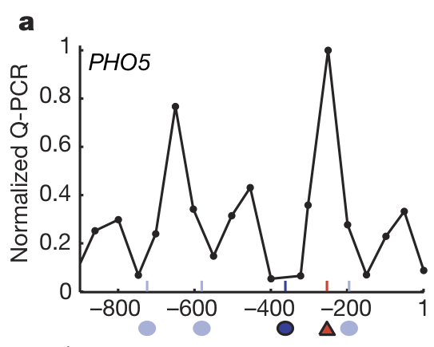

## Question
Why are some genomic sites only bound by _C. glabrata_ Pho4 but not _S. cerevisiae_ Pho4, in the same genetic background?

## Background
In our previous work (He _et al_. 2017 eLife), we found that the transcription factor (TF) regulating the phosphate starvation response, named Pho4, exhibited different levels of dependency on the co-activator Pho2 between two related species of yeasts, the budding yeast _S. cerevisiae_ and the related commensal and opportunistic pathogen _C. glabrata_. Specifically, _C. glabrata_ Pho4 (hereinafter as CgPho4) doesn't need Pho2's help to bind and activate gene expression. As a result of the loss of this constraint, we found it can bind to far more places and activate 2-3 fold more genes than its ortholog in _S. cerevisiae_ (hence ScPho4). We asked whether this difference is intrinsic to CgPho4 protein or is it primarily due to differences in the co-activator or the genome background. To test this, we replaced the protein sequence of ScPho4 with that of CgPho4 in the _S. cerevisiae_ background, and asked whether CgPho4 can function without Pho2 in the exogenous genome. The answer is yes. When compared in the same genome background, CgPho4 is able to bind 115 sites in the genome compared with 74 for ScPho4. Moreover, CgPho4 binding is far less dependent on Pho2 than ScPho4 is, that is, deleting Pho2 doesn't abolish CgPho4 binding while nearly all ScPho4 binding vanishes.

What is puzzling for us is when we look at the DNA sequences of those binding sites and try to identify apparent differences to explain why some of the sites are only bound by CgPho4 but not ScPho4. First of all, we should note that in all 74 sites bound by ScPho4, CgPho4 also binds (although 2 showed lower binding affinity and was not included in the 115 list). The first thing we checked is the presence of the consensus E-box motif, "CACGTG", which both ScPho4 and CgPho4 recognize. It turns out that all but 4 sites contain the motif (most have one, a handful have multiples). Among the 4 that don't have a consensus site, one or more instances of "one-bp-off", e.g. CAAGTG, can be identified and seem to align with the binding peak. However, two of the four sites without consensus motif were bound by both ScPho4 and CgPho4. So the presence of consensus motif doesn't appear to explain the difference between the two TF orthologs.

Two other possibilities I looked into is whether the CgPho4-only sites were bound more strongly by Cbf1, a competing TF, or obstructed by nucleosome. For the former, Cbf1 is a TF recognizing the same core motif but having a different preference for the 5' flanking nucleotide than Pho4 (Cbf1 prefers T while Pho4 likes G). A quick look didn't reveal an obvious difference:

For the latter, I compared nucleosome occupancy under **high phosphate conditions** as provided in the supplementary table 2 from [Zhou & O'Shea 2011](https://www.ncbi.nlm.nih.gov/pmc/articles/PMC3127084). My reason for using the nucleosome occupancy measured under high phosphate condition is that this reflects the "starting state" before either ScPho4 or CgPho4 enters the nucleus (needs further consideration). The result suggested a slightly higher occupancy among the CgPho4-only sites, but I'm unsure how much this explains the binding difference. 

The reason for revisiting this problem is triggered by our re-reading of the [Lam _et al_. 2008](http://www.nature.com/nature/journal/v453/n7192/full/nature06867.html) paper. A relevant technical detail is that ChIP-peaks are relatively wide, covering ~300 bp, which may contain more than one consensus and one-bp-off motifs. With this in mind, look at the detailed analyses of the _PHO5_ promoter below from the Lam 2008 paper:

Note that the entire promoter is under a single ChIP-peak (data not shown) and there is a single instance of a consensus site "CACGTG". In my previous analysis, I would have attributed both ScPho4 and CgPho4's binding to this site the consensus motif. In reality, however, the non-consensus CACGTT motif in the exposed UASp1 site (solid blue circle) plays a crucial role: it allows ScPho4 to bind with the help of ScPho2, recruit the chromatin remodeling complex, which lead to the exposure of the CACGTG motif in UASp2. Without the weak motif, ScPho4 cannot bind to the consensus site at all, as demonstrated by the lack of gene induction:

Pay attention to the "WT" (fourth from the bottom) compared with mutant A2 (second from top). Note how the ablation of the exposed weak site (solid bluecircle, not embedded in nucleosome, which are the grey ovals) abolishes gene induction, even though the nucleosome-occulded consensus site (red triangle) is intact.

## Goal
Determine if there are structural differences between the sites bound by both ScPho4 and CgPho4 (Type-1), vs those only accessible to CgPho4 (Type-2), in _S. cerevisiae_

## Data
| Data | Source | Notes |
| ---- | ------ | ----- |
| ChIP-bound sites | [He _et al_ 2017, eLife](data/he_2017_fig4_data.txt) | both ScPho4 and CgPho4, contains gene induction data as well |
| _S. cerevisiae_ genome sequences | [ENSEMBL](ftp://ftp.ensembl.org/pub/release-100/fasta/saccharomyces_cerevisiae/dna/) | the genome coordinates of the above table is based on _S. cerevisiae_ genome R64-2-1, which is based on genome sequences of R64-1-1 |
| Nucleosome occupancy | [Zhou and O'Shea 2011](https://www.ncbi.nlm.nih.gov/pmc/articles/PMC3127084/) | wig file through the [GEO datasets](https://www.ncbi.nlm.nih.gov/geo/query/acc.cgi?acc=GSM730535) or raw FASTQ files through the [SRA Run selector](https://www.ncbi.nlm.nih.gov/Traces/study/?acc=PRJNA141451&o=acc_s%3Aa) |

## Approach
Perform a "X-ray scan" of each ChIP-identified peak at the resolution of single binding sites in relation to nucleosome binding. Essentially create many plots like the one made for _PHO5_ promoter by Lam et al above. Our naive hypothesis is that type-2 sites would be characterized by the presence of only a nucleosome-occluded consensus site.

To achieve this, we need to collect the following types of data for each ChIP-peak, and plot them in parallel:
1. Promoter position as the X-axis
1. Nucleosome occupancy under high or low phosphate conditions, calculated from nucleosome profiling data (see below)
1. Motif location and quality (motif scan can be done with a simple Python script, like the one Jia wrote)
1. Motif conservation within the _sensu stricto_ species (the solid vs light shade in the _PHO5_ figure)

### Process nucleosome data
_Option 1_

- Use the processed "wig" format file from the link above. This can be directly loaded into R and plotted as the occupancy

_Option 2_

- Start from the raw fastq files and perform mapping ourselves.

